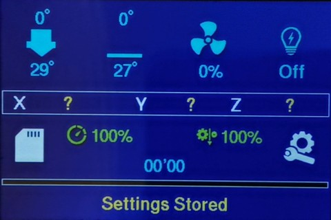
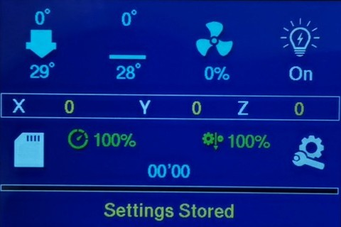
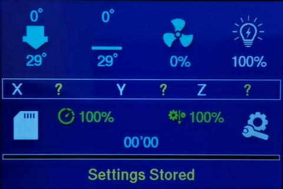

# Caselight_FBG5_mod
## Case light button mod for FB Ghost5 Marlin firmware.

This mod adds a button to Marlin status screen for switching of a case light ([M355](https://marlinfw.org/docs/gcode/M355.html) command). Only for TFT 480x320 display (Flyingbear Ghost 5) and ColorUI interface. Checked on [Sergey1560 firmware](https://github.com/Sergey1560/Marlin_FB4S).

The button can switсh off/on the light and shows the brightness (if it's used).

Here is an [example](https://github.com/Sergey1560/fb4s_howto/tree/master/case_led) of implementation from Sergey1560.

### How to install
1. Change the files in `Marlin\src\lcd\tft` folders.
2. Enable `#define CASE_LIGHT_ENABLE` in `Configuration_adv.h` file and make the needed settings depends from your solution.
3. Set `CASE_LIGHT_PIN` for output pin which controls the swithing of light. You can do it in `Configuration_adv.h` file or in pins file. For example, the pin `PA3` for FB Ghost5 Robin Nano 1.x in `pins_MKS_ROBIN_NANO.h`:
```
#if ENABLED(CASE_LIGHT_ENABLE)
  #define CASE_LIGHT_PIN                    PA3
#endif
```
If you want to use the PWM control of brightness, the output pin must support the PWM.

If you have additional elements like a temperature of chamber, perhaps you need to modify `ui_common.h` file for adding of a case light button.

## Модификация кнопки управления подсветкой корпуса для прошивки FB Ghost5 Marlin.

Модификация добавляет на экрна состояния Marlin кнопку включения подсветки корпуса (команда [M355](https://marlinfw.org/docs/gcode/M355.html)). Только для TFT экрана 480x320 (Flyingbear Ghost5) и интерфейса ColorUI. Проверено на [прошивке от Sergey1560](https://github.com/Sergey1560/Marlin_FB4S).

Кнопка позволяет включать/выключать подсветку с выводом текущей яркости (при использовании управления яркостью).

[Пример](https://github.com/Sergey1560/fb4s_howto/tree/master/case_led) реализации подсветки от Sergey1560.

### Установка
1. Замените файлы в директории `Marlin\src\lcd\tft`.
2. Задайте `#define CASE_LIGHT_ENABLE` в файле `Configuration_adv.h` и настройте секцию согласно вашему решению.
3. Задайте в `CASE_LIGHT_PIN` номер пина, который конролирует подсветку. Это можно сделать в файле `Configuration_adv.h` или в файле pins. Например, можно задать пин `PA3` для платы FB Ghost5 Robin Nano 1.x в файле `pins_MKS_ROBIN_NANO.h`:
```
#if ENABLED(CASE_LIGHT_ENABLE)
  #define CASE_LIGHT_PIN                    PA3
#endif
```
Если вы хотите использовать управление яркостью через ШИМ (PWM), пин должен поддерживать режим PWM.

Если у вас подключены другие элементы интерфейса, например, температура камеры, возможно, кнопку управления подсветкой потребуется добавить в файле `ui_common.h` в соответствующей секции.

## Photos of screen / Фото интерфейса
Off state / Выключено



On state (no brightness control) / Включено (нет управления яркостью)



On state with brightness / Включено с уровнем яркости


